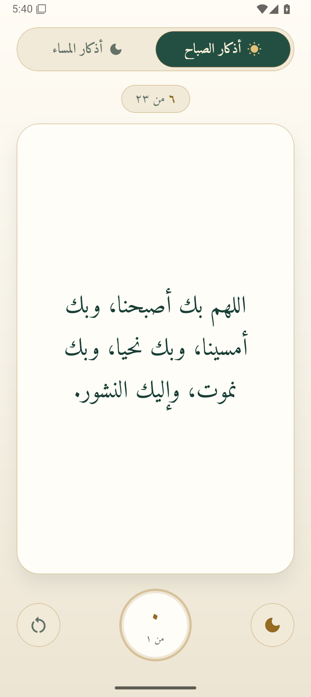
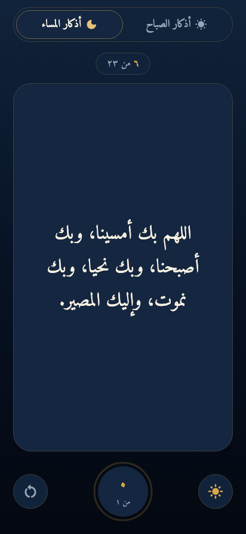

<p align="center"></p>
<h1 align="center">أذكار · Azkar</h1>
<p align="center">A quiet space for morning and evening remembrance.</p>
<p align="center">React Native · Android · Offline · No ads · No accounts</p>

## Download · تحميل التطبيق

**[Download Azkar 2.1.0 for Android (APK)](https://github.com/YouseifUS/azkar/releases/download/v2.1.0/Azkar-v2.1.0.apk)** · [All releases](https://github.com/YouseifUS/azkar/releases)

الإصدار الجديد مبني باستخدام React Native وTypeScript، بنفس النصوص وخط Amiri والأيقونة والألوان وواجهة القراءة. يمكنك تثبيته فوق إصدار Flutter 1.1.2 مع الاحتفاظ بالعدادات والوضع المحفوظ. لا تحذف النسخة القديمة قبل تثبيت التحديث.

## Screenshots

<p align="center"> &nbsp; </p>

## Features

- 23 morning and 23 evening adhkar with the original reviewed Arabic content, bundled offline.
- The same Amiri regular/bold fonts, ivory/green/gold light mode and navy/gold dark mode.
- Tap the card or circular counter to count; completion advances to the next dhikr. Swipe right for the next dhikr and left for the previous one. Long text scrolls vertically.
- Independent morning/evening counters, capped at each dhikr’s repetition target.
- A checkmark beside each completed period and a “تم ورد اليوم” dialog when all its adhkar are finished. Completion follows the saved counters and clears after reset.
- Theme button to the right of the counter, reset button with confirmation to the left.
- Theme and counters persist across reopening and in-place updates from Flutter.
- Daily reset at the latest local Fajr boundary, while open and upon resume or background refresh.
- Local reminders 30 minutes after Fajr and Asr, using Egyptian calculation parameters and Shafi Asr.
- A rolling 14-day reminder schedule, background refresh every 12 hours, and rescheduling after reboot, app update, clock or timezone changes.
- Permission explanations and an application-settings shortcut. Reading works when location or notifications are declined.
- No ads, analytics, account, backend, or API key.

## الاستخدام

عند إتمام جميع أذكار الصباح أو المساء تظهر علامة صح بجانب الورد ونافذة «تم ورد اليوم». اختر أذكار الصباح أو المساء، واضغط على بطاقة الذكر أو العداد للتسبيح. اسحب يمينًا للذكر التالي ويسارًا للسابق. زر الشمس/الهلال على يمين العداد يغيّر الوضع ويحفظه، وزر إعادة الضبط على اليسار يصفّر العدادات بعد التأكيد. اسمح بالموقع والإشعارات لتفعيل التذكير بعد الفجر والعصر بنصف ساعة.

## Run and build

Requirements: Node.js 22.11+, JDK 17, Android SDK 36, NDK 27.1.12297006. The application uses React Native 0.86.3 and React 19.2.3, native React Native views with Hermes, and a small Android bridge for storage, local prayer calculation, location and system reminders. Flutter is not part of the active build.

```sh
npm ci
npm start
# Separate terminal, with a connected Android device or emulator:
npm run android
```

Configure `android/local.properties` with `sdk.dir=/path/to/android-sdk`, or set `ANDROID_HOME`.

```sh
npm run validate
cd android
./gradlew testDebugUnitTest assembleRelease
```

Installable APK: `android/app/build/outputs/apk/release/app-release.apk`. The release contains the JS bundle, fonts and texts; Metro is not required.

### Signing and updates

Application ID stays `com.yousefmojahid.adhkar_app`; version is 2.1.0, code 9. This release uses the same existing local Android signing key as Flutter 1.x so installation preserves local data. Keys are ignored and never committed. Build on the original machine with its existing `~/.android/debug.keystore`, or provide `AZKAR_KEYSTORE`, `AZKAR_STORE_PASSWORD`, `AZKAR_KEY_ALIAS`, and `AZKAR_KEY_PASSWORD`. A different key cannot update the distributed 1.x APK in place. Configure a private production key and a signing migration strategy before store distribution.

### Compatibility with previous installations

The bridge reads and writes the existing `FlutterSharedPreferences` file and `flutter.*` keys directly: counters, theme, coordinates, timezone and last Fajr reset boundary. There is no destructive data conversion. Updates cancel obsolete reminder intents and background jobs before scheduling the replacement services. These compatibility identifiers are plain Android storage and component names; they do not require a Flutter runtime or SDK. The repository contains only the React Native application, its Android bridge, tests and required assets.

## Privacy and reminders

Counters, appearance and coordinates remain on the device. Prayer times are calculated locally; no location is uploaded. Location and notification permissions are used only for reminders. Android battery policies and denied permissions can delay or prevent reminders. Exact alarms are used when Android allows them, otherwise an inexact alarm is scheduled, as in Flutter 1.x.

## Verification

TypeScript checks and React Native component tests cover card/counter interaction, separate periods, reset confirmation, theme persistence, permission setup, Arabic digits, RTL swipe boundaries, fonts and text parity. Android regression tests cover reading Flutter preferences, capped counters, Fajr reset idempotence, offline/permission fallback, and 14-day alarm scheduling. See [migration verification](docs/react-native-migration.md) for this release’s device checks and limitations.

Reviewed text references: [content audit](docs/content-audit.md). Font licenses: [Amiri OFL](assets/fonts/OFL.txt) and [Material Icons Apache license](assets/fonts/MaterialIcons_LICENSE.txt).

## License

[MIT](LICENSE). Anyone may use, copy, modify and redistribute the application, including commercially, while retaining the license and copyright notice.

Copyright © 2026 Yousef Mojahid.
